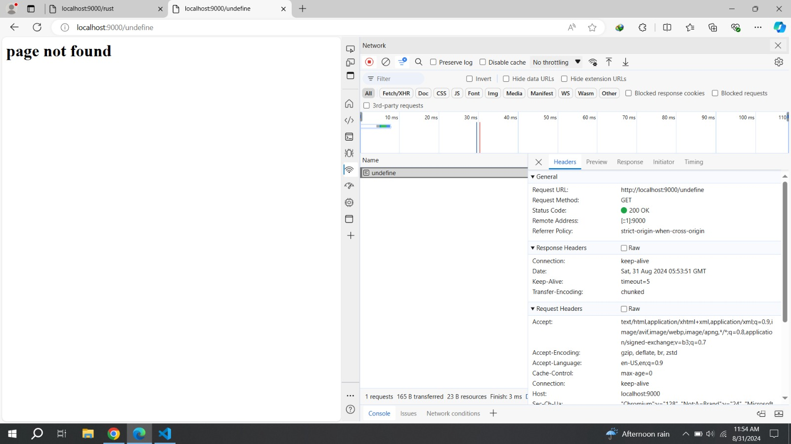
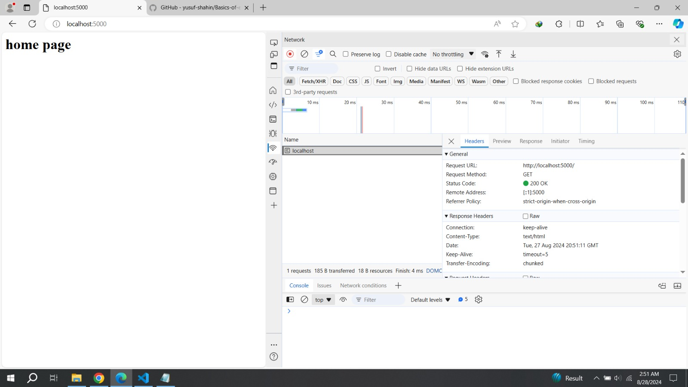
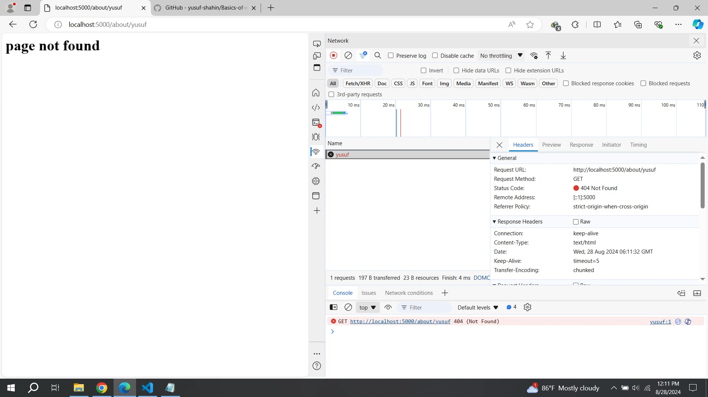

# Basics of Express.js

**Simple introduction of _HTTP module_ and _express js_ **

```js
//! ===============
//? express js :
//! ===============

const express = require("express");
const app = express();

app.get("/", (req, res) => {
  res.send("<h1>Hello world</h1>");
});

app.listen(9000, () => {
  console.log("Example app listening on port 9000");
});

// ! ===============
//? same thing using HTTP modules
// ! ===============

const http = require("http");

const server = http.createServer((req, res) => {
  res.write("<h1>hello people</h1>");
  res.end();
});

server.listen(9000, () => {
  console.log("Example app listening on port 9000");
});
```

### Introduction to HTTP :-


- [Click This Article to learn HTTP modules in details](https://www.freecodecamp.org/news/http-and-everything-you-need-to-know-about-it/)

_**HTTP-Basics**_

- http is a build module of node, it is avalavle in **node_modules** folder, so just import it in our project .
- `const http = require('http')`

**create a http server**

- `const server = http.createServer((req, res) => {})`

- We pass two peremeter in _**http.createServer()**_ method **require** and **request**

- listen(9000, () => comsole.log(message))


_**http.createServer() Example :-**_

```js
const http = require("http");
const server = http.createServer((req, res) => {
  console.log("user hit the server");
  //# every time when we refreash our browser, in console we see this message
  res.write("Hello this is my Home page");
  res.end();
});

server.listen(9000, () => {
  console.log("Example app listening on port 9000");
});
```

- **localhost:9000**

**Create a basic _HTTP Server_ :-**

```js
const server = http.createServer((req, res) => {
  // console.log(req.method); //# --> GET
  // console.log(req.url); //# --> /
  const url = req.url;

  // in url "http://localhost:5000/about/yusuf"
  // console.log(req.url); //# --> /about/yusuf

  // home page
  if (url === "/") {
    res.write("<h1>home page</h1>");
    res.end();
  }
  // about page
  else if (url === "/about") {
    res.write("<h1>about page</h1>");
    res.end();
  }

  // 404
  else {
    res.write("<h1>page not found</h1>");
    res.end();
  }
});

server.listen(9000, () => {
  console.log("Example app listening on port 9000");
});
```

- **here, in _url_ if we write `http://localhost:9000/undefine` , borwser show us :-**


**But in borwser network we find this :-**



- **Page not found , but still in _network_ everything is gonna ok**
- Here come the concept of _HTTP Headers_ .

**_HTTP Headers_**

- **writeHead()** property, introduced in Node.js v1.0. It is part of the 'http' module. It is **used to send a response header to the incoming request.** The status code represents a _**3-digit HTTP status code**_ (e.g., 404), and the headers parameter contains the response headers.

- [What is HTTP response status code ?](https://developer.mozilla.org/en-US/docs/Web/HTTP/Status).

- `res.writeHead(200, { "content-type": "text/html" });`

- res.writeHead(3-digit HTTP status code, {"content-type": ...})

- **content-type**, could be _"text/html" , "text/css", "image/svg+xml", "text/javascript"_ .

```js
const server = http.createServer((req, res) => {
   res.writeHead(200, { "content-type": "text/html" });
   // res.end("<h1>home page</h1>") or -->
    res.write("<h1>home page</h1>");
    res.end();
  }
});
```

- In the browser [localhost:9000](http://localhost:9000/) , any url we pass like `http://localhost:9000/about` or `http://localhost:9000/info` . The server always show us **Hello, This is Home Page**

**_HTTP-Request-Object_**

- `console.log(req.url); //# --> /`

```js
const http = require("http");

const server = http.createServer((req, res) => {
  // console.log(req.method); //# --> GET
  console.log(req.url); //# --> /

  // in url "http://localhost:9000/about/yusuf"
  // console.log(req.url); //# --> /about/yusuf

  // home page
  if (url === "/") {
    res.writeHead(200, { "content-type": "text/html" });
    res.write("<h1>home page</h1>");
    res.end();
  }

  // about page
  else if (url === "/about") {
    res.writeHead(200, { "content-type": "text/html" });
    res.write("<h1>about page</h1>");
    res.end();
  }

  // 404
  else {
    res.writeHead(404, { "content-type": "text/html" });
    res.write("<h1>page not found</h1>");
    res.end();
  }
});

server.listen(9000);
```

- to see the information from browser
- _**inspect** ---> **network** --> **localhost**_

_**When browser find the url :-**_



_**When browser do not find the url :-**_



**[Simple HTTP module navbar project]**(https://github.com/yusuf-shahin/Basics-of-node-js/tree/main/simple%20http%20modules%20project)

## Expree JS

- [CLick here to learn express more](https://www.freecodecamp.org/news/express-explained-with-examples-installation-routing-middleware-and-more/)

- `npm init -y`
- `npm install express`

_**Import this in our project**_

```js
const express = require("express");
const app = express();
```

**in _app_ , we have a obj with banch of useful method**

- app.get
- app.post
- app.put
- app.delete
- app.all ()
- app.use
- app.listen

**Our focus**


**Building a Server with Express :-**

```js
const express = require("express");
const app = express();

app.get("/", (req, res) => res.send("Hello World!"));

app.listen(9000, () => console.log("Example app listening on port 9000!"));
```

- `get("path",callBack func);`
- inside callback function `(req,res) => res.send()`
- inside **send()** method we easily pass a _string_ or _HTML_ .
- same , If want to create a page **about** we just write
- `app.get("/about", (req, res) => res.send(<h1>about page</h1>));`

**If _url_ gonna wrong or anything , we can easily set our _app.all()_ method**

```js
app.all("*", (req, res) => {
  res.send("<h1>resource not found</h1>");
});
```

- we also send **status()** method before **send()**
- `res.status(404).send("<h1>resource not found</h1>");`
- inside **_status()_** we pass **HTTP status code**

**_Simple version of HTTP modules in Express_**

**Instead of this code :-**

```js
const http = require("http");
const server = http.createServer((req, res) => {
  // console.log(req.method); //# --> GET
  console.log(req.url); //# --> /

  // in url "http://localhost:9000/about/yusuf"
  // console.log(req.url); //# --> /about/yusuf

  const url = req.url;
  // home page
  if (url === "/") {
    res.writeHead(200, { "content-type": "text/html" });
    res.write("<h1>home page</h1>");
    res.end();
  }
  // about page
  else if (url === "/about") {
    res.writeHead(200, { "content-type": "text/html" });
    res.write("<h1>about page</h1>");
    res.end();
  }
  // 404
  else {
    res.writeHead(404, { "content-type": "text/html" });
    res.write("<h1>page not found</h1>");
    res.end();
  }
});

server.listen(9000);
```

**We can do this by using _Express_ :-**

```js
const express = require("express");

const app = express();

app.get("/", (req, res) => {
  res.status(200).send("<h1>About Page</h1>");
});

app.get("/about", (req, res) => {
  res.status(200).send("<h1>About Page</h1>");
});

// just like else
app.all("*", (req, res) => {
  res.status(404).send("<h1>resource not found</h1>");
});

app.listen(9000, () => {
  console.log("server is listening on port 9000...");
});

app.listen(9000);
```

- we dont need to create a server like **HTTP** module.

- [**Express Project**](https://github.com/yusuf-shahin/Basics-of-express.js/tree/main/simple%20express-js%20project)

### JSON
