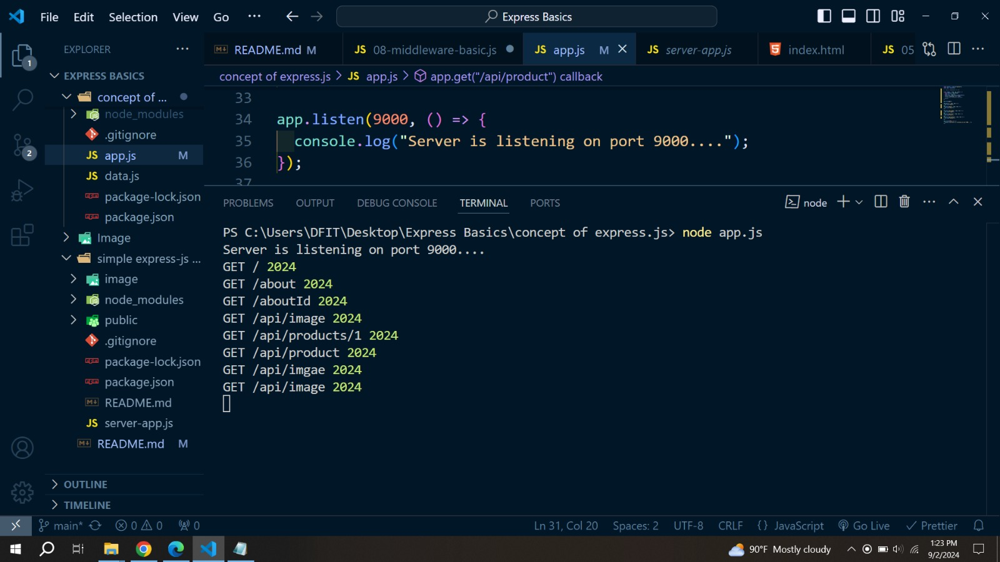

# Basics of Express.js

- _Domain_ : **localhost:9000**

**Simple introduction of _HTTP module_ and _express js_ **

```js
//! ===============
//? express js :
//! ===============

const express = require("express");
const app = express();

app.get("/", (req, res) => {
  res.send("<h1>Hello world</h1>");
});

app.listen(9000, () => {
  console.log("Example app listening on port 9000");
});

// ! ===============
//? same thing using HTTP modules
// ! ===============

const http = require("http");

const server = http.createServer((req, res) => {
  res.write("<h1>hello people</h1>");
  res.end();
});

server.listen(9000, () => {
  console.log("Example app listening on port 9000");
});
```

### Introduction to HTTP :-


- [Click This Article to learn HTTP modules in details](https://www.freecodecamp.org/news/http-and-everything-you-need-to-know-about-it/)

#### **HTTP-Basics**

- http is a build module of node, it is avalavle in **node_modules** folder, so just import it in our project .
- `const http = require('http')`

**create a http server**

- `const server = http.createServer((req, res) => {})`

- We pass two peremeter in _**http.createServer()**_ method **require** and **request**

- listen(9000, () => comsole.log(message))


_**http.createServer() Example :-**_

```js
const http = require("http");
const server = http.createServer((req, res) => {
  console.log("user hit the server");
  //# every time when we refreash our browser, in console we see this message
  res.write("Hello this is my Home page");
  res.end();
});

server.listen(9000, () => {
  console.log("Example app listening on port 9000");
});
```

- **localhost:9000**

**Create a basic _HTTP Server_ :-**

```js
const server = http.createServer((req, res) => {
  // console.log(req.method); //# --> GET
  // console.log(req.url); //# --> /
  const url = req.url;

  // in url "http://localhost:5000/about/yusuf"
  // console.log(req.url); //# --> /about/yusuf

  // home page
  if (url === "/") {
    res.write("<h1>home page</h1>");
    res.end();
  }
  // about page
  else if (url === "/about") {
    res.write("<h1>about page</h1>");
    res.end();
  }

  // 404
  else {
    res.write("<h1>page not found</h1>");
    res.end();
  }
});

server.listen(9000, () => {
  console.log("Example app listening on port 9000");
});
```

- **here, in _url_ if we write `http://localhost:9000/undefine` , borwser show us :-**


**But in borwser network we find this :-**


- **Page not found , but still in _network_ everything is gonna ok**
- Here come the concept of _HTTP Headers_ .

#### _HTTP Headers_

- **writeHead()** property, introduced in Node.js v1.0. It is part of the 'http' module. It is **used to send a response header to the incoming request.** The status code represents a _**3-digit HTTP status code**_ (e.g., 404), and the headers parameter contains the response headers.

- [What is HTTP response status code ?](https://developer.mozilla.org/en-US/docs/Web/HTTP/Status).

- `res.writeHead(200, { "content-type": "text/html" });`

- res.writeHead(3-digit HTTP status code, {"content-type": ...})

- **content-type**, could be _"text/html" , "text/css", "image/svg+xml", "text/javascript"_ .

```js
const server = http.createServer((req, res) => {
   res.writeHead(200, { "content-type": "text/html" });
   // res.end("<h1>home page</h1>") or -->
    res.write("<h1>home page</h1>");
    res.end();
  }
});
```

- In the browser [localhost:9000](http://localhost:9000/) , any url we pass like `http://localhost:9000/about` or `http://localhost:9000/info` . The server always show us **Hello, This is Home Page**

#### _HTTP-Request-Object_

- `console.log(req.url); //# --> /`

```js
const http = require("http");

const server = http.createServer((req, res) => {
  // console.log(req.method); //# --> GET
  console.log(req.url); //# --> /

  // in url "http://localhost:9000/about/yusuf"
  // console.log(req.url); //# --> /about/yusuf

  // home page
  if (url === "/") {
    res.writeHead(200, { "content-type": "text/html" });
    res.write("<h1>home page</h1>");
    res.end();
  }

  // about page
  else if (url === "/about") {
    res.writeHead(200, { "content-type": "text/html" });
    res.write("<h1>about page</h1>");
    res.end();
  }

  // 404
  else {
    res.writeHead(404, { "content-type": "text/html" });
    res.write("<h1>page not found</h1>");
    res.end();
  }
});

server.listen(9000);
```

- to see the information from browser
- _**inspect** ---> **network** --> **localhost**_

_**When browser find the url :-**_


_**When browser do not find the url :-**_


**[Simple HTTP module navbar project]**(https://github.com/yusuf-shahin/Basics-of-node-js/tree/main/simple%20http%20modules%20project)

## Expree JS

- [CLick here to learn express more](https://www.freecodecamp.org/news/express-explained-with-examples-installation-routing-middleware-and-more/)

- `npm init -y`
- `npm install express`

_**Import this in our project**_

```js
const express = require("express");
const app = express();
```

**in _app_ , we have a obj with banch of useful method**

- [app.get](https://www.geeksforgeeks.org/express-js-http-methods/#get-method)
- [app.post](https://www.geeksforgeeks.org/express-js-http-methods/#post-method)
- [app.put](https://www.geeksforgeeks.org/express-js-http-methods/#put-method)
- [app.delete](https://www.geeksforgeeks.org/express-js-http-methods/#delete-method)
- app.all ()
- app.use
- app.listen

- [**Learn more to click this article**](https://www.freecodecamp.org/news/http-request-methods-explained/)

**In a image**


**Building a Server with Express and show it to browser :-**

```js
const express = require("express");
const app = express();

app.get("/", (req, res) => res.send("Hello World!"));

app.listen(9000, () => console.log("Example app listening on port 9000!"));
```

- `app.get` that is the HTTP method, that all browser perform by default .
- `get("path",callBack func);`
- inside callback function `(req,res) => res.send()`
- inside **send()** method we easily pass a _string_ or _HTML_ .
- same , If want to create a page **about** we just write
- `app.get("/about", (req, res) => res.send(<h1>about page</h1>));`

**If _url_ gonna wrong or anything , we can easily set our _app.all()_ method**

```js
app.all("*", (req, res) => {
  res.send("<h1>resource not found</h1>");
});
```

- we also send **status()** method before **send()**
- `res.status(404).send("<h1>resource not found</h1>");`
- inside **_status()_** we pass **HTTP status code**

**_Simple version of HTTP modules in Express_**

**Instead of this code :-**

```js
const http = require("http");
const server = http.createServer((req, res) => {
  // console.log(req.method); //# --> GET
  console.log(req.url); //# --> /

  // in url "http://localhost:9000/about/yusuf"
  // console.log(req.url); //# --> /about/yusuf

  const url = req.url;
  // home page
  if (url === "/") {
    res.writeHead(200, { "content-type": "text/html" });
    res.write("<h1>home page</h1>");
    res.end();
  }
  // about page
  else if (url === "/about") {
    res.writeHead(200, { "content-type": "text/html" });
    res.write("<h1>about page</h1>");
    res.end();
  }
  // 404
  else {
    res.writeHead(404, { "content-type": "text/html" });
    res.write("<h1>page not found</h1>");
    res.end();
  }
});

server.listen(9000);
```

**We can do this by using _Express_ :-**

```js
const express = require("express");

const app = express();

app.get("/", (req, res) => {
  res.status(200).send("<h1>About Page</h1>");
});

app.get("/about", (req, res) => {
  res.status(200).send("<h1>About Page</h1>");
});

// just like else
app.all("*", (req, res) => {
  res.status(404).send("<h1>resource not found</h1>");
});

app.listen(9000, () => {
  console.log("server is listening on port 9000...");
});

app.listen(9000);
```

- we dont need to create a server like **HTTP** module.

- [**Express Project**](https://github.com/yusuf-shahin/Basics-of-express.js/tree/main/simple%20express-js%20project)

## JSON

**res.json([body])**

- Sends a JSON response. This method sends a response (with the correct content-type) that is the parameter converted to a JSON string using JSON.[stringify()](https://developer.mozilla.org/en-US/docs/Web/JavaScript/Reference/Global_Objects/JSON/stringify)

- The parameter can be any JSON type, including object, array, string, Boolean, number, or null, and you can also use it to convert other values to JSON.

```js
const express = require("express");
const app = express();
app.get("/", (req, res) => {
  //# sent json file
  res.status(200).json([
    { name: "yusuf", age: 30 },
    { name: "nazmul", age: 25 },
  ]);
});

app.listen(9000, () => {
  console.log("Server is listening on port 9000....");
});
```

**_Also we gonna do this_**

**create json file name _data.js_**

```js
const products = [
  {
    id: 1,
    name: "albany sofa",
    image:
      "https://dl.airtable.com/.attachments/6ac7f7b55d505057317534722e5a9f03/9183491e/product-3.jpg",
    price: 39.95,
    desc: `I'm baby direct trade farm-to-table hell of, YOLO readymade raw denim venmo whatever organic gluten-free kitsch schlitz irony af flexitarian.`,
  },
  {
    id: 2,
    name: "entertainment center",
    image:
      "https://dl.airtable.com/.attachments/da5e17fd71f50578d525dd5f596e407e/d5e88ac8/product-2.jpg",
    price: 29.98,
    desc: `I'm baby direct trade farm-to-table hell of, YOLO readymade raw denim venmo whatever organic gluten-free kitsch schlitz irony af flexitarian.`,
  },
  {
    id: 3,
    name: "albany sectional",
    image:
      "https://dl.airtable.com/.attachments/05ecddf7ac8d581ecc3f7922415e7907/a4242abc/product-1.jpeg",
    price: 10.99,
    desc: `I'm baby direct trade farm-to-table hell of, YOLO readymade raw denim venmo whatever organic gluten-free kitsch schlitz irony af flexitarian.`,
  },
  {
    id: 4,
    name: "leather sofa",
    image:
      "https://dl.airtable.com/.attachments/3245c726ee77d73702ba8c3310639727/f000842b/product-5.jpg",
    price: 9.99,
    desc: `I'm baby direct trade farm-to-table hell of, YOLO readymade raw denim venmo whatever organic gluten-free kitsch schlitz irony af flexitarian.`,
  },
];
module.exports = { products };
```

**import that _data.js_ module and show them to browser**

```js
const express = require("express");
const app = express();
//# product in data.js
const { products } = require("./data");
app.get("/", (req, res) => {
  res.status(200).json(products);
});

app.listen(9000, () => {
  console.log("Server is listening on port 9000....");
});
```

**in browser we see this**


- if inspect our _network_ tab --> _header_ --> _response header_ we can see that **Content-Type** is **json**

**We also modify the json file and show it to browser :-**

```js
const express = require("express");
const app = express();
//# product in data.js
const { products } = require("./data");
app.get("/", (req, res) => {
  //# sent html file :-
  res.send('<h1> Home Page</h1><a href="/api/products">products</a>');
  //# create a anchor tag to show our json file
});

app.get("/api/products", (req, res) => {
  //# create a new modidy array of obj and name it show product...
  const newProducts = products.map((product) => {
    const { id, name, price } = product;
    //# return id, name, price as object...
    return { name, id, price };
  });
  res.status(200).send(newProducts);
});

app.listen(9000, () => {
  console.log("Server is listening on port 9000....");
});
```

- in here we just see **name, id , price** list of products in our browser.

**Provide the info about one specific product :-**

simple system to render the **single product**...

```js
app.get("/api/products/1", (req, res) => {
  const singleProduct = products.find((product) => {
    return product.id === 1;
  });
  res.status(200).send(singleProduct);
});
```

**_"/api/products/1"_ use this url , we can render this product in browser.**


- everythings is okk! but we dont set the specific _url_ in everytime.
- here comes the concept of **params** in express.

## Params in URL

- parameters in Uniform Resource Locator

- [**Difference between params anquery**](https://github.com/yusuf-shahin/Basics-of-express.js/tree/main/params%20and%20query#difference-between-params-and-query-strings-params)

#### **_params property :-_**

instead of hard coding this `/api/products/1`, `/api/products/2` , `/api/products/3` we setup **a route parameter**

**What is params in express js ?**

- params object **allows you to capture dynamic values from the URL path.** It is useful when you have route patterns with placeholders, such as `“/products/:productId”` here **:productId** is the _route params_ . **_params_ comes just after the colon mark -->.** `:`
- `app.get("/api/products/:productID", (req, res) => {})`

using **params** in browser _url_ :-`localhost:9000/users/abcd`

```js
app.get("/api/products/:id", (req, res) => {
  const { id } = req.params;
  console.log(id); //# --> "abcd"
});
```

- in console we get `abcd`

- like **:productID** we can set any name in here. Name dose not matter . in url after `/api/products/` what will we write . The value of _:productID_ is automatically set.

**example in details :-**

- in url we write `localhost:9000/api/products/yusuf`

```js
app.get("/api/products/:productID", (req, res) => {
  console.log(req.params);
  // console.log(req.params.productID) //# --> "yusuf"

  //* same thing in obj destructering
  const { productID } = req.params;
});
```

- in console we get `{productID : "yusuf"}` , here **productId** is the key and **"yusuf"** is the value

same as in url we pass `localhost:9000/api/products/1` :-

```js
app.get("/api/products/:id", (req, res) => {
  const { id } = req.params;
  // in url we write ==> "/api/products/1"
  //# value of :productID it always be a string .
});
```

- in console we get `1`
- value of _params_ it always be a string .

**using we can render the product dynamically in browser**

```js
app.get("/api/products/:productID", (req, res) => {
  const { productID } = req.params;

  const singleProduct = products.find(
    (product) => product.id === Number(productID)
    //# using Number() method coz "productID" is a string. or we can also use double equal " == " in this code.
  );

  //* if id dose not find
  if (!singleProduct) {
    return res.status(404).send("<h1>Product Does Not Exist</h1>");
  }

  return res.json(singleProduct);
});
```

**All thing in one code :-**

```js
const express = require("express");
const app = express();
//# product in data.js
const { products } = require("./data");
app.get("/", (req, res) => {
  //# sent html file :-
  res.send('<h1> Home Page</h1><a href="/api/products">products</a>');
});

app.get("/api/products", (req, res) => {
  const newProducts = products.map((product) => {
    const { id, name, price } = product;
    //# return id, name, price as object...
    return { name, id, price };
  });
  res.status(200).send(newProducts);
});

app.get("/api/products/:productID", (req, res) => {
  const { productID } = req.params;

  const singleProduct = products.find(
    (product) => product.id === Number(productID)
  );

  //* if id dose not find
  if (!singleProduct) {
    return res.status(404).send("Product Does Not Exist");
  }

  return res.json(singleProduct);
});

app.listen(9000, () => {
  console.log("Server is listening on port 9000....");
});
```

**Extra information :-**

- in path we pass a lot _params_ as wish as we want .

- in browser _url_ we pass `localhost:9000/api/products/4/reviews/yusuf`

```js
app.get("/api/products/:productID/reviews/:reviewID", (req, res) => {
  console.log(req.params);
  res.send("hello world");
});
```

- console we see that `{productID : 4, reviewID : yusuf}`

#### **_query string params_ :-**

- **(url parameters)**

**What is a Query Parameter?**

- A query string is, to put it simply, the portion of a **URL (Uniform Resource Locator) that comes just after the question mark -->.** `?`

**Example:**

- This is an illustration of a URL with query strings of a blog website that requests blogs on page number 3 and limits the response to only 3 objects. `https://helloworldblogs.com/search?page=2&limit=3`

- limit and Page, which have values of 3 and 2, respectively, are actual key-value pairs that make up the express query params. like that :-
  

in _URL_ we pass `localhost:9000/api/v1/query?name=yusuf&id=7518`

on **app.js**

```js
const express = require("express");
const app = express();
const { products } = require("./data.js");

app.get("/api/v1/query", (req, res) => {
  console.log(req.query);

  res.status(200).json(products);
});

app.listen(9000, () => {
  console.log("Server is listening on port 9000....");
});
```

- after `localhost:9000/api/v1/query` this paths everything is _query string_
- in console we get `{name : "yusuf" , id : "7518"}`

**Expline in Image**

- **In browser url** we pass `localhost:9000/api/v1/query?name=yusuf&id=7518`


- browser it show us the result , because in url `localhost:9000/api/v1/query` path is correct . If this path was wrong browser show us error .

in console we get :-


- - here **name** and **id** is _key_ and **yusuf** and **7518** is the _value_

- **in url if we pass `localhost:9000/api/v1/query` or `localhost:9000/api/v1/query?` in console we get a empty object `{}`**

same we can set any `key=value` after `?` mark and get them by `req.query` property .

- `const {name} =  req.query ` --> we can get the _value_ of **name** _key_

#### **_Middleware Function_**


- express middleware are function that execute during the request the server . Each middleware function has access to **request and reaponse** object . `request --> middleware func --> response`

**There are Three types of _middleware_ func :-**

- **own middleware** --> create the middleware func in our code .
- **express middleware** --> express provides quite a few built-in middleware functions. for example [app.use(express.static(./public))](https://github.com/yusuf-shahin/Basics-of-express.js/tree/main/simple%20express-js%20project) . Here `express.static(./public)` is build in express _middleware_ .
- **third pirty middleware** --> [CLick this to learn more...](https://www.geeksforgeeks.org/how-to-use-third-party-middleware-in-express-js/)

**Basic level**

- [Learn more to click this article...](https://dev.to/m__mdy__m/middleware-in-expressjs-4b4)

- **route** _middleware_ :-

```js
const express = require("express");
const app = express();

//  req ==> middleware ==> res

//* middleware function
const logger = (req, res, next) => {
  const method = req.method;
  const url = req.url;
  const time = new Date().getFullYear();
  console.log(method, url, time);
  next();
};

app.get("/", logger, (req, res) => {
  res.send("Home");
});
app.get("/about", logger, (req, res) => {
  res.send("About");
});

app.listen(9000, () => {
  console.log("Server is listening on port 9000....");
});
```

- create a _own middleware_ logger function and pass it as the parameter of **get()** .
- express supply three parameters in our _middleware_ **logger** function .
- those parameters are **(req,res,next)** .
- middleware is so powerful that , when we work with _middleware_ we also **res.send()** from it . It will work. We can do that or we pass it on next by invoking **next()** function .
- in `localhost:9000`, everytime we refreash the browser, we get `GET / 2024` in our console .
- `localhost:9000/about` , in browser we get `GET /about 2024` in our console .

But the most common approach is pass the _middleware_ func inside **use()** method .

** _app.use()_ method :-**

- in every time pass the middleware func in hard for us .
- inside **app.use()** function we apply our _middleware_ func in our all route.

```js
const express = require("express");
const app = express();

//  req ==> middleware ==> res

const logger = (req, res, next) => {
  const method = req.method;
  const url = req.url;
  const time = new Date().getFullYear();
  console.log(method, url, time);
  // res.send("middleware teasting")
  next();
};

//* middleware use() func
app.use(logger);

app.get("/", (req, res) => {
  res.send("Home");
});
app.get("/image", (req, res) => {
  res.send("About");
});
app.get("/test", (req, res) => {
  res.send("About");
});
app.get("/about", (req, res) => {
  res.send("About");
});

app.listen(9000, () => {
  console.log("Server is listening on port 9000....");
});
```

in browser _url_ we write `localhost:9000/` , `localhost:9000/about` , `localhost:9000/aboutId` , `localhost:9000/api/image` , `localhost:9000/api/products/1` ,`localhost:9000/api/product` , `localhost:9000/api/image` , `localhost:9000/api/image`

**in console** we see that :-


We also pass the _path_ in **use()** method, like :-

- `app.use("/api", logger);`

- _middleware_ **logger** func will work after path `/api/` .

- the code after path `/api/` pass in our use method :-

```js
const express = require("express");
const app = express();

//  req ==> middleware ==> res
const logger = (req, res, next) => {
  const method = req.method;
  const url = req.url;
  const time = new Date().getFullYear();
  console.log(method, url, time);
  // res.send("middleware teasting")
  next();
};

app.use("/api/", logger);

app.get("/", (req, res) => {
  res.send("Home");
});
app.get("/about", (req, res) => {
  res.send("About");
});

app.get("/api/image", (req, res) => {
  res.send("image");
});
app.get("/api/test", (req, res) => {
  res.send("test");
});
app.get("/api/product", (req, res) => {
  res.send("product");
});

app.listen(9000, () => {
  console.log("Server is listening on port 9000....");
});
```

- in _url_ we write `localhost:9000/` , `localhost:9000/about` , `localhost:9000/aboutId` , `localhost:9000/api/image` , `localhost:9000/api/products/1` ,`localhost:9000/api/product` , `localhost:9000/api/image` , `localhost:9000/api/image`

**in console** we see that :-


- in _url_ `localhost:9000/api` after that path our _middleware_ function is work .

- [**learn more...**](https://expressjs.com/en/4x/api.html#app.use)

**_Multiple Middleware function_ :-**

- using array inside **use()** method, we can set multiple middleware func

```js
const express = require("express");
const app = express();

const logger = (req, res, next) => {
  console.log("This is logger func...");
  next();
};

//* authorize middleware
const authorize = (req, res, next) => {
  console.log("This is authorize func...");
  next();
};

app.use([logger, authorize]);
// api/home/about/products

app.get("/", (req, res) => {
  res.send("Home");
});
app.get("/about", (req, res) => {
  res.send("About");
});
app.get("/api/products", (req, res) => {
  res.send("Products");
});
app.get("/api/user", (req, res) => {
  console.log(req.user);
  res.send("user");
});

app.listen(9000, () => {
  console.log("Server is listening on port 9000....");
});
```

- every time we refreash the browser, in console we get :-

```
This is logger func...
This is authorize func...
```

- the we pass two middleware func as array inside **use()** method, will always follow the order it is executed , first **logger** func then **authorize** func .
- If we filp those two , first **authorize** func then **logger** func. in console we get :-

```
This is authorize func...
This is logger func...
```

**_complecated example_ :-**

- in browser _url_ we pass `http://localhost:9000/about/?user=yusuf`
- **code**

```js
const express = require("express");
const app = express();

//* middleware func
const logger = (req, res, next) => {
  console.log(req.user);
  next();
};

//* middleware func
const authorize = (req, res, next) => {
  const { user } = req.query;
  if (user === "yusuf") {
    req.user = { name: "shahin", id: 19 };
    req.userDetails = {
      name: "Yusuf Shahin",
      job: "Web Developer",
      location: "Noakhali",
    };
    console.log(req.url);
    next();
  } else {
    res.status(401).send("Unauthorize");
  }
};

app.use([authorize, logger]);

//? get() method :-

app.get("/", (req, res) => {
  res.send("Home");
});
app.get("/about", (req, res) => {
  console.log(req.userDetails);

  res.send("About Yusuf Shahin");
});
app.get("/api/products", (req, res) => {
  res.send("Products");
});
app.get("/api/user", (req, res) => {
  console.log(req.user);
  res.send("user");
});

app.listen(9000, () => {
  console.log("Server is listening on port 9000....");
});
```

- in that code , in _query string parameters_ we must must pass `?user=yusuf` . Because in _middleware authorize_ func we set the codition :- if **query string params** _key_ === user and _value_ === "yusuf" . Otherwise it always **send** the **response** _unauthorize_ .

- if _query string parameters_ === `?user=yusuf` then we go our **logger** func . **logger** func indicate our _url path_ .

- here come the most interesting thing . in browser we pass this `http://localhost:9000/about/?user=yusuf` _url_ :-

- in console we get :-

```js
/about/?user=yusuf
{ name: 'shahin', id: 19 }
{ name: 'Yusuf Shahin', job: 'Web Developer', location: 'Noakhali' }
```

- `req.url`(authorize func) ---> `req.user()`(logger func) --> `req.userDetails`(app.get("/about"))


- in browser :-


**_Extra Info_**

- passing middleware func to our all **app.get()** method, we use **app.use()** func and pass the middleware inside it. Or if we want pass the middleware specific path like `localhost:9000/api/user` . We set this _route_ middleware :-

```js
// comment out this :-
// app.use([authorize, logger])

app.get("/api/user", [authorize, logger], (req, res) => {
  console.log(req.user);
  res.send("user");
});
```

## POST method :-

- do a mini project with post method .

#### Methods - POST (Form Example)

- send the HTTP request from _HTML_

**(./methods-public)** ---> **index.html**

```html
<body>
  <nav>
    <div class="nav-center">
      <h5>HTTP Methods</h5>
      <div>
        <a href="index.html">regular </a>
        <a href="javascript.html">javascript </a>
      </div>
    </div>
  </nav>
  <main>
    <form action="/login" method="POST">
      <h3>Traditional Form</h3>
      <div class="form-row">
        <label for="name"> enter name </label>
        <input type="text" name="name" id="name" autocomplete="false" />
      </div>
      <button type="submit" class="block">submit</button>
    </form>
  </main>
</body>
```

In express.js :-

```js
const express = require("express");
const app = express();
const { people } = require("./data.js");

//* all static code
app.use(express.static("./methods-public"));

app.listen(9000, () => {
  console.log("Server is listening on port 9000....");
});
```

- In browser we see this :-


- **In that _HTML_ code our main part is** :-

```html
<form action="/login" method="POST">
  <h3>Traditional Form</h3>
  <div class="form-row">
    <label for="name"> enter name </label>
    <input type="text" name="name" id="name" autocomplete="false" />
  </div>
  <button type="submit" class="block">submit</button>
</form>
```

- In **HTML** _form_-tag `action is "/login"` and `method is "POST"`, so in `/login` url or we are submiting the form . Inside the form, we have input and a submit button.

- If we type `yusuf` in input and click the submit button . the url is `http://localhost:9000/login` and we see the browser :-


- If we inspect our **network** , we find that `Request Method is POST`


- In we click the **plyload** beside the **server** form-data :- `name: yusuf`


- In **HTML** in _form_-tag we provide a `name="name"` , here **name** is the _key_ and **yusuf** is the _value_ . We can set any _key-name_ instead of **name** . Suppose , in **HTML** form , if write `name="testing"` in form-data we get `testing: yusuf` .

As our `method is "POST"` , so in express we write :-

```js
app.post("/login", (req, res) => {
  res.send("Posting");
});
```

- now we write `yusuf` in input and click the submit button . After clicking **submit** button , it took us in that _url_ ---> `http://localhost:9000/login` and browser show us **Posting** .

- inside `app.post()` method , if we write `console.log(req.body);` in console we get `undefine` . For that reason in middleware we pass `app.use(express.urlencoded({ extended: false }))` .


- Now in console we get `[Object: null prototype] { name: 'yusuf' }`
- What is **express.urlencoded()** Function ? [Click this to learn details...](https://www.geeksforgeeks.org/express-js-express-urlencoded-function/)

So in **app.post()** we can set that :-

```js
app.post("/login", (req, res) => {
  // console.log(req.body); //# --> {name: "yusuf"}
  const { name } = req.body;
  if (name) {
    res.status(200).send(`Welcome Mohammad ${name}`);
  } else {
    res.status(401).send("Confirm your name first");
  }
});
```

- using this code we show the name that is _typing_ **input** in our **browser**.
- in we inspect and **network** --> **headers** --> **request headers** --> **content-type: application/x-www-form-urlencoded** because in middleware we pass `app.use(express.urlencoded({ extended: false }));`

#### Methods - POST (javascript Example)

In this case, it's gonna be done strictly using JavaScript and we'll use JavaScript to send our HTTP requests.

in **./methods-public** folder ---> **javascript.html** file

```html
<main>
  <section>
    <form>
      <h3>Javascript Form</h3>
      <div class="form-row">
        <label for="name"> enter name </label>
        <input
          type="text"
          name="name"
          id="name"
          class="form-input"
          autocomplete="false"
        />
        <small class="form-alert"></small>
      </div>
      <button type="submit" class="block submit-btn">submit</button>
    </form>
    <div class="result"></div>
  </section>
</main>
```

- In that case we dont have the `action=""` and `method=""` in the **HTML** _form_-tag but in _input_ we have `name` attribute.

**Using front-end** we fatch people from server .

CDN link of AXIOS Library in _HTML_ ...

```js
<script
  src='https://cdnjs.cloudflare.com/ajax/libs/axios/0.21.1/axios.min.js'
  integrity='sha512-bZS47S7sPOxkjU/4Bt0zrhEtWx0y0CRkhEp8IckzK+ltifIIE9EMIMTuT/mEzoIMewUINruDBIR/jJnbguonqQ=='
  crossorigin='anonymous'
></script>
```

- In _HTML_ `<div class="result"></div>` we want to show the data .

so ,

```js
const result = document.querySelector(".result");

//* this funcion fatching the people from server
const fetchPeople = async () => {
  try {
    //# fetch data from '/api/people' which is create in app.js . so make sure this api gonna mathch
    //# in app.js --> app.get('/api/people', (req,res) => {
    // res.status(200).json({ success: true, data: people })
    // })
    const { data } = await axios.get("/api/people");
    console.log(data); //* data = {success: true, data: Array(5)}

    const people = data.data.map((person) => {
      return `<h5>${person.name}</h5>`;
    });
    result.innerHTML = people.join("");
  } catch (error) {
    result.innerHTML = `<div class="alert alert-danger">Can't Fetch Data</div>`;
  }
};
fetchPeople();
```

- here we fatch data from server `/api/people` , in app.js we already create this :-

```js
const { people } = require("./data.js");
app.get("/api/people", (req, res) => {
  res.status(200).json({ success: true, data: people });
});
```

- as we fetch data from `/api/people` this url so, `axios.get("/api/people")` and `app.get("/api/people", (req, res) => {})` gonna match with each other
