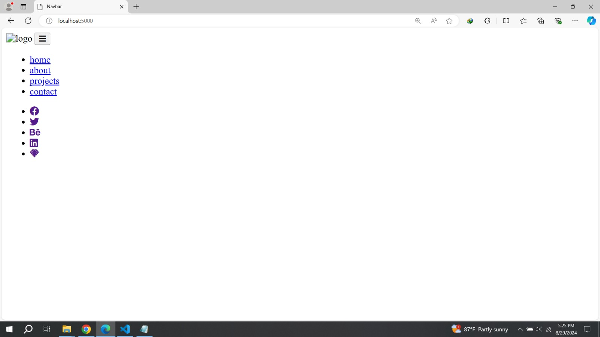

# Navbar project using Express js

- as _express_ is a third pirty module. so , first we need to install it.

- `npm init -y`
- `npm install express`
- create .gitignore file --> `/node_modules`

**import express from _node-modules_**

```js
const express = require("express");
const app = express();

app.listen(5000);
```

- import path from _node-modules_ `const path = require("path");`
- What is path modules ? [Click here](https://github.com/yusuf-shahin/Basics-of-node-js?tab=readme-ov-file#what-is-path-module-)

- [Click here to learn details...](https://mirzaleka.medium.com/working-with-paths-in-node-js-447cd0f2ec56)

**Routing**

- [Express routing in details](https://expressjs.com/en/guide/routing.html)

```js
const express = require("express");
const path = require("path");

const app = express();

app.get("/", (req, res) => {
  //# __dirname --> (server-app.js)
  res.sendFile(path.resolve(__dirname, "./index.html"));
});

app.all("*", (req, res) => {
  res.status(404).send("resource not found");
});

app.listen(5000, () => {
  console.log("server is listening on port 5000....");
});
```

- `style.css` , `logo.svg` , `browser-app.js` those (setup static and middleware) path we dont get .

**For that reason the result in browser**



**the network**


- So we must want to get `style.css` , `logo.svg` , `browser-app.js` those path (setup static and middleware) .

**_create a folder name "public"_**

- copy `style.css` , `logo.svg` , `browser-app.js`
- past thats all file in **public** folder

**setup static and middleware**
`app.use(express.static("./public"));`

### The whole code is :-

```js
const express = require("express");
const path = require("path");

const app = express();

// setup static and middleware
app.use(express.static("./public"));

app.get("/", (req, res) => {
  //# __dirname --> (server-app.js)
  res.sendFile(path.resolve(__dirname, "./index.html"));
});

app.all("*", (req, res) => {
  res.status(404).send("resource not found");
});

app.listen(5000, () => {
  console.log("server is listening on port 5000....");
});
```

**Another approach _SSR_**

**move _"./index.html"_ file --> _"./public"_ folder**

- we dont need this code `res.sendFile(path.resolve(__dirname, "./index.html"));` , so comment out them.

- everything is gonna okk
